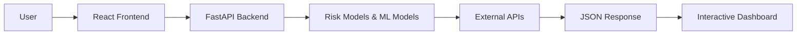
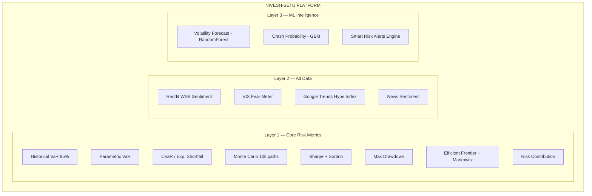
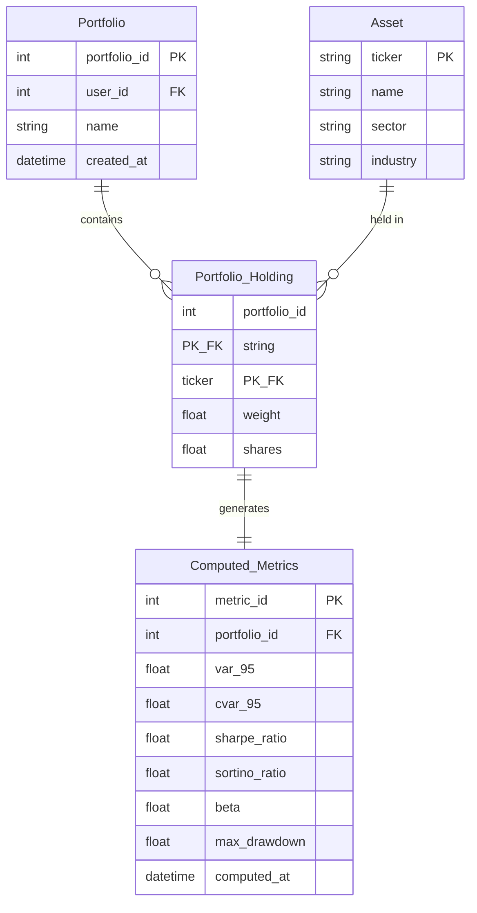

# Nivesh-Setu — Stock Portfolio Risk Analyzer

**Institutional-grade portfolio risk intelligence platform combining quantitative risk metrics, alternative data, and ML-powered insights.**

---

## 1. Problem Statement

### Problem Title
**Lack of Accessible Portfolio Risk Analytics for Retail Investors**

### Problem Description
Retail investors increasingly manage diversified stock portfolios. However, understanding true portfolio risk requires more than observing daily gains and losses.

Professional risk metrics such as **Value at Risk (VaR)**, **CVaR**, **Sharpe Ratio**, **Sortino Ratio**, **Beta**, and **Correlation Matrices** provide deeper insight into portfolio exposure. These tools are typically available only through expensive institutional platforms.

Most retail investors:
- Do not measure portfolio volatility properly
- Overestimate diversification
- Ignore tail risk
- Make decisions based on intuition rather than statistical analysis

### Target Users
- Retail investors
- Finance students
- Quant enthusiasts
- Long-term portfolio managers
- Academic researchers

### Existing Gaps
- No lightweight desktop tool integrating risk metrics + simulations + alternative data
- Limited free tools for Monte Carlo risk modeling
- Lack of interactive visualization for portfolio analytics
- Poor understanding of diversification risk
- No integration of sentiment analysis with traditional risk metrics

---

## 2. Problem Understanding & Approach

### Root Cause Analysis
Retail investors lack:
- Structured risk analytics
- Statistical modeling tools
- Visualization of portfolio exposure
- Scenario-based stress testing
- Access to alternative data signals (sentiment, market fear indicators)

Existing brokerage dashboards focus mainly on:
- P&L tracking
- Basic performance metrics
- No advanced risk decomposition

### Solution Strategy
Build a full-stack portfolio risk intelligence platform that:
- Accepts portfolio holdings (tickers + weights)
- Fetches historical data using yfinance
- Computes professional-grade risk metrics
- Runs Monte Carlo simulations
- Integrates alternative data (Reddit sentiment, VIX, Google Trends)
- Applies ML for volatility forecasting
- Visualizes risk exposure interactively

---

## 3. Proposed Solution

### Solution Overview
**Nivesh-Setu** (Hindi: *Bridge to Investment*) is a full-stack, AI-augmented portfolio risk intelligence platform built with Python, FastAPI, React, and Plotly.js.

### Core Idea
Convert historical stock data and alternative signals into actionable risk insights using:
- Quantitative finance formulas
- Monte Carlo simulations
- Matrix algebra
- Modern Portfolio Theory (Markowitz)
- Machine Learning forecasting
- NLP sentiment analysis

### Key Features

| Layer | Features |
|-------|----------|
| **Layer 1: Core Risk** | Historical VaR, Parametric VaR, CVaR, Monte Carlo (10k paths), Sharpe Ratio, Sortino Ratio, Beta, Max Drawdown, Risk Contribution, Correlation Matrix, Efficient Frontier, Markowitz Optimization |
| **Layer 2: Alt Data** | Reddit Sentiment (r/wallstreetbets via PRAW + VADER), VIX Fear Meter, Google Trends Hype Index, News Sentiment |
| **Layer 3: ML Intelligence** | Volatility Forecasting (RandomForest), Crash Probability Predictor (GradientBoosting), Smart Risk Alerts |

---

## 4. System Architecture

### High-Level Flow



### Architecture Description
1. User inputs portfolio tickers and weights via React dashboard
2. Backend fetches historical adjusted close data using yfinance
3. Data is cleaned and converted to daily returns
4. Statistical metrics and covariance matrix are computed
5. Risk models (VaR, CVaR, Monte Carlo, Optimization) are executed
6. Alternative data (Reddit, VIX, Trends) is fetched and analyzed
7. ML models generate forecasts and alerts
8. Results are visualized using Plotly.js interactive charts

### Architecture Diagram



---

## 5. Database Design

### ER Diagram



### ER Diagram Description
**Entities:**
- **Portfolio**: User's portfolio with metadata
- **Asset**: Stock tickers with company information
- **Portfolio_Holding**: Junction table linking portfolios to assets with weights
- **Computed_Metrics**: Cached risk metrics per portfolio

**Note:** MVP version uses in-memory computation without persistent database. Database schema shown for future scalability.

---

## 6. Dataset Selected

### Dataset Name
**Historical Stock Price Data + Alternative Data Signals**

### Source
- **Price Data**: Yahoo Finance via `yfinance` Python library
- **Reddit Data**: Reddit API via `praw`
- **Google Trends**: Google Trends API via `pytrends`
- **VIX Data**: CBOE Volatility Index via Yahoo Finance (`^VIX`)

### Data Type
- Daily Adjusted Close Prices
- Volume Data
- Market Index Data (S&P 500 for beta calculation)
- Reddit post titles and scores
- Google search interest over time
- VIX index values

### Selection Reason
- Free and accessible
- Decades of historical data
- Supports equities and ETFs
- Real-time alternative data signals
- Sufficient for risk modeling

### Preprocessing Steps
1. Download adjusted close prices
2. Align dates across tickers
3. Handle missing values (forward fill)
4. Compute daily log returns
5. Calculate covariance matrix
6. Normalize portfolio weights
7. Aggregate sentiment scores

---

## 7. Model Selected

### Model Name
**Statistical Risk Modeling + Machine Learning Forecasting**

**Includes:**
- Historical Simulation VaR
- Parametric Gaussian VaR
- CVaR (Expected Shortfall)
- Monte Carlo Simulation
- Markowitz Mean-Variance Optimization
- VADER Sentiment Analysis
- RandomForest Volatility Forecaster
- GradientBoosting Crash Probability Predictor

### Selection Reasoning
- Industry-standard risk measurement techniques
- Computationally efficient
- Interpretable results
- Suitable for retail-level portfolios
- ML models capture non-linear patterns in volatility

### Alternatives Considered
- GARCH volatility models (too complex for MVP)
- Student-t distribution modeling (fat tails)
- Black-Litterman model (requires investor views)
- Factor models (Fama-French)
- LSTM neural networks (overkill for 24h hackathon)

### Evaluation Metrics
- Portfolio volatility
- VaR at 95% and 99%
- Sharpe ratio
- Maximum drawdown
- Risk-adjusted returns
- ML model RMSE and accuracy

---

## 8. Technology Stack

### Frontend
| Technology | Purpose |
|------------|---------|
| React 18 | UI framework |
| Plotly.js | Interactive charts |
| Axios | HTTP client |
| CSS3 | Styling with dark theme |

### Backend
| Technology | Purpose |
|------------|---------|
| Python 3.11 | Primary language |
| FastAPI | REST API framework |
| NumPy | Matrix operations |
| Pandas | Data manipulation |
| SciPy | Optimization algorithms |
| yfinance | Stock data fetching |
| PRAW | Reddit API |
| pytrends | Google Trends |
| VADER | Sentiment analysis |

### ML/AI
| Model | Purpose |
|-------|---------|
| RandomForest | Volatility forecasting |
| GradientBoosting | Crash probability |
| Monte Carlo | Risk simulation |

### Database
- MVP: In-memory processing
- Future: SQLite / PostgreSQL

### Deployment
- Local development
- Future: Railway (backend) + Vercel (frontend)

---

## 9. API Documentation & Testing


### API Testing Screenshots


---

## 10. Module-wise Development & Deliverables

### Checkpoint 1: Research & Planning
**Deliverables:**
- [x] Risk model selection
- [x] Mathematical validation of formulas
- [ ] UI wireframe design
- [ ] Architecture diagram

### Checkpoint 2: Backend Development
**Deliverables:**
- [ ] Data fetching engine (yfinance)
- [ ] Return computation module
- [ ] Covariance matrix calculation
- [ ] VaR implementation (Historical + Parametric)
- [ ] CVaR implementation
- [ ] Sharpe & Sortino ratio
- [ ] Beta calculation
- [ ] Max Drawdown
- [ ] Risk Contribution per asset

### Checkpoint 3: Frontend Development
**Deliverables:**
- [ ] React dashboard setup
- [ ] Portfolio input UI
- [ ] Metric cards visualization
- [ ] Monte Carlo chart (Plotly)
- [ ] Correlation heatmap
- [ ] Scenario slider
- [ ] Efficient Frontier chart
- [ ] VIX Fear Meter gauge
- [ ] Sentiment panel

### Checkpoint 4: Model Training
**Deliverables:**
- [ ] Monte Carlo simulation engine
- [ ] Markowitz optimization
- [ ] RandomForest volatility forecaster
- [ ] GradientBoosting crash predictor

### Checkpoint 5: Model Integration
**Deliverables:**
- [ ] Monte Carlo API endpoint
- [ ] Optimization API endpoint
- [ ] ML forecast endpoint
- [ ] Alert engine

### Checkpoint 6: Deployment
**Deliverables:**
- [ ] Local development setup
- [ ] Docker configuration
- [ ] Cloud deployment
- [ ] Documentation completion

---

## 11. End-to-End Workflow

```
1. User enters portfolio (tickers + weights) in React UI
2. Frontend sends POST /analyze to FastAPI backend
3. Backend fetches:
   - Historical prices from yfinance
   - S&P 500 benchmark data
   - VIX index data
4. Compute daily returns and covariance matrix
5. Calculate risk metrics (VaR, CVaR, Sharpe, Sortino, Beta, MDD)
6. Run Monte Carlo simulation (10,000 paths × 252 days)
7. Generate Efficient Frontier + optimal portfolios
8. Fetch alternative data:
   - Reddit sentiment via PRAW
   - Google Trends via pytrends
9. Run ML models for volatility forecast
10. Return JSON response to frontend
11. Render interactive Plotly charts
12. User can run scenario analysis with shock sliders
```

---

## 12. Demo & Video

| Resource | Link |
|----------|------|
| **Live Demo** | (Add deployed URL) |
| **Demo Video** | (Add YouTube/Loom link) |
| **GitHub Repository** | (Add GitHub repo link) |

---

## 13. Hackathon Deliverables Summary

| Deliverable | Status |
|-------------|--------|
| Functional risk analytics dashboard | In Progress |
| Monte Carlo simulation engine | In Progress |
| Portfolio optimization module | Pending |
| Interactive visualization interface | In Progress |
| Alternative data integration (Reddit, VIX, Trends) | Pending |
| ML volatility forecasting | Pending |
| Smart risk alerts | Pending |

---

## 14. Team Roles & Responsibilities

| Member Name | Role | Responsibilities |
|-------------|------|------------------|
| Vinay Sharma | Quant Developer | Risk modeling, Monte Carlo simulation, optimization |
| Ashvin Tiwari | Backend Engineer | FastAPI development, data processing, ML integration |
| Sumit Kumar | Frontend Developer | React dashboard, Plotly visualizations, UI/UX |

---

## 15. Future Scope & Scalability

### Short-Term
- Add CVaR optimization
- Add downside risk analysis
- Add multi-currency support
- Add portfolio comparison feature
- Complete ML forecasting pipeline

### Long-Term
- Add Black-Litterman model
- Add factor-based modeling (Fama-French)
- Add real-time streaming data
- Convert into SaaS platform
- Add AI-driven portfolio recommendations
- User authentication and saved portfolios
- PDF report export

---

## 16. Known Limitations

| Limitation | Impact |
|------------|--------|
| Assumes normal distribution in parametric VaR | May underestimate tail risk |
| Relies on historical data assumptions | Past ≠ Future |
| No real-time high-frequency data | Limited intraday analysis |
| Market regime shifts not modeled | Black swan events not captured |
| Reddit API rate limits | May need caching |
| Monte Carlo assumes normal distribution | Real markets have fat tails |

---

## 17. Impact

| Impact Area | Benefit |
|-------------|---------|
| **Retail Investors** | Access to institutional-grade risk tools |
| **Financial Literacy** | Interactive learning of risk concepts |
| **Data-Driven Decisions** | Replaces intuition with analytics |
| **Market Awareness** | Sentiment + VIX integration shows market mood |
| **Portfolio Health** | Identifies diversification weaknesses |

---

## 📁 Project Structure

```
our_project_24/
├── backend/
│   ├── main.py              # FastAPI app + endpoints
│   ├── data_fetcher.py      # yfinance data layer
│   ├── metrics.py           # VaR, CVaR, Sharpe, Sortino, Beta, MDD
│   ├── monte_carlo.py       # Monte Carlo simulation
│   ├── optimization.py      # Efficient Frontier + Markowitz
│   ├── scenario.py          # Scenario analysis
│   ├── models.py            # Pydantic request/response models
│   ├── requirements.txt     # Python dependencies
│   └── tests/
│       └── test_api.py      # API tests
├── frontend/
│   ├── package.json
│   ├── public/
│   │   └── index.html
│   └── src/
│       ├── App.jsx          # Main application
│       ├── api.js           # API client
│       ├── components/      # React components
│       └── styles/          # CSS styling
├── Problem.md
├── README.md
└── checkpoints.md
```

---

