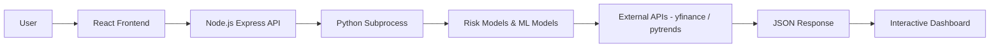
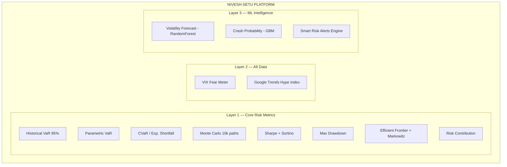
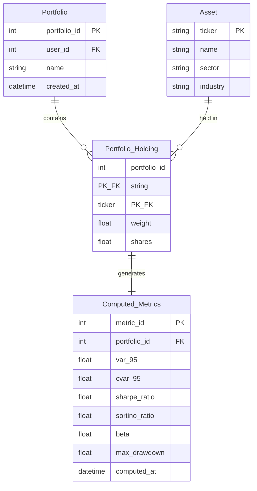

# Nivesh-Setu — Stock Portfolio Risk Analyzer

**Institutional-grade portfolio risk intelligence platform combining quantitative risk metrics, alternative data, and ML-powered insights — built with Node.js, Python, and React.**

---

## 1. Problem Statement

### Problem Title
**Lack of Accessible Portfolio Risk Analytics for Retail Investors**

### Problem Description
Retail investors increasingly manage diversified stock portfolios. However, understanding true portfolio risk requires more than observing daily gains and losses.

Professional risk metrics such as **Value at Risk (VaR)**, **CVaR**, **Sharpe Ratio**, **Sortino Ratio**, **Beta**, and **Correlation Matrices** provide deeper insight into portfolio exposure. These tools are typically available only through expensive institutional platforms.

Most retail investors:
- Do not measure portfolio volatility properly
- Overestimate diversification
- Ignore tail risk
- Make decisions based on intuition rather than statistical analysis

### Target Users
- Retail investors
- Finance students
- Quant enthusiasts
- Long-term portfolio managers
- Academic researchers

### Existing Gaps
- No lightweight desktop tool integrating risk metrics + simulations + alternative data
- Limited free tools for Monte Carlo risk modeling
- Lack of interactive visualization for portfolio analytics
- Poor understanding of diversification risk
- No integration of sentiment analysis with traditional risk metrics

---

## 2. Problem Understanding & Approach

### Root Cause Analysis
Retail investors lack:
- Structured risk analytics
- Statistical modeling tools
- Visualization of portfolio exposure
- Scenario-based stress testing
- Access to alternative data signals (sentiment, market fear indicators)

Existing brokerage dashboards focus mainly on:
- P&L tracking
- Basic performance metrics
- No advanced risk decomposition

### Solution Strategy
Build a full-stack portfolio risk intelligence platform that:
- Accepts portfolio holdings (tickers + weights)
- Fetches historical data using yfinance
- Computes professional-grade risk metrics
- Runs Monte Carlo simulations
- Integrates alternative data (VIX, Google Trends)
- Applies ML for volatility forecasting
- Visualizes risk exposure interactively

---

## 3. Proposed Solution

### Solution Overview
**Nivesh-Setu** (Hindi: *Bridge to Investment*) is a full-stack, AI-augmented portfolio risk intelligence platform built with Node.js (Express), Python, and React.

### Core Idea
Convert historical stock data and alternative signals into actionable risk insights using:
- Quantitative finance formulas
- Monte Carlo simulations
- Matrix algebra
- Modern Portfolio Theory (Markowitz)
- Machine Learning forecasting
- NLP sentiment analysis

### Key Features

| Layer | Features |
|-------|----------|
| **Layer 1: Core Risk** | Historical VaR, Parametric VaR, CVaR, Monte Carlo (10k paths), Sharpe Ratio, Sortino Ratio, Beta, Max Drawdown, Risk Contribution, Correlation Matrix, Efficient Frontier, Markowitz Optimization |
| **Layer 2: Alt Data** | VIX Fear Meter, Google Trends Hype Index |
| **Layer 3: ML Intelligence** | Volatility Forecasting (RandomForest), Crash Probability Predictor (GradientBoosting), Smart Risk Alerts |

---

## 4. System Architecture

### High-Level Flow



### Architecture Description
1. User inputs portfolio tickers and weights via React dashboard
2. Frontend sends `POST /api/analyze` to the Express backend
3. Express spawns a Python child process, forwarding the request payload via stdin
4. Python fetches historical adjusted close data using `yfinance`
5. Data is cleaned and converted to daily returns
6. Statistical metrics and covariance matrix are computed
7. Risk models (VaR, CVaR, Monte Carlo, Optimization) are executed
8. Alternative data (VIX, Google Trends) is fetched and analyzed
9. ML models generate volatility forecasts and risk alerts
10. Python writes JSON result to stdout; Express forwards it to the frontend
11. Results are visualized using Plotly.js and Recharts interactive charts

### Architecture Diagram



---

## 5. Database Design

### ER Diagram



### ER Diagram Description
**Entities:**
- **Portfolio**: User's portfolio with metadata
- **Asset**: Stock tickers with company information
- **Portfolio_Holding**: Junction table linking portfolios to assets with weights
- **Computed_Metrics**: Cached risk metrics per portfolio

**Note:** MVP version uses in-memory computation without persistent database. Database schema shown for future scalability.

---

## 6. Dataset Selected

### Dataset Name
**Historical Stock Price Data + Alternative Data Signals**

### Source
- **Price Data**: Yahoo Finance via `yfinance` Python library
- **Google Trends**: Google Trends API via `pytrends`
- **VIX Data**: CBOE Volatility Index via Yahoo Finance (`^VIX`)

### Data Type
- Daily Adjusted Close Prices
- Volume Data
- Market Index Data (S&P 500 for beta calculation)
- Google search interest over time
- VIX index values

### Selection Reason
- Free and accessible
- Decades of historical data
- Supports equities and ETFs
- Real-time alternative data signals
- Sufficient for risk modeling

### Preprocessing Steps
1. Download adjusted close prices
2. Align dates across tickers
3. Handle missing values (forward fill)
4. Compute daily log returns
5. Calculate covariance matrix
6. Normalize portfolio weights

---

## 7. Model Selected

### Model Name
**Statistical Risk Modeling + Machine Learning Forecasting**

**Includes:**
- Historical Simulation VaR
- Parametric Gaussian VaR
- CVaR (Expected Shortfall)
- Monte Carlo Simulation
- Markowitz Mean-Variance Optimization
- RandomForest Volatility Forecaster
- GradientBoosting Crash Probability Predictor

### Selection Reasoning
- Industry-standard risk measurement techniques
- Computationally efficient
- Interpretable results
- Suitable for retail-level portfolios
- ML models capture non-linear patterns in volatility

### Alternatives Considered
- GARCH volatility models (too complex for MVP)
- Student-t distribution modeling (fat tails)
- Black-Litterman model (requires investor views)
- Factor models (Fama-French)
- LSTM neural networks (overkill for 24h hackathon)

### Evaluation Metrics
- Portfolio volatility
- VaR at 95% and 99%
- Sharpe ratio
- Maximum drawdown
- Risk-adjusted returns
- ML model RMSE and accuracy

---

## 8. Technology Stack

### Frontend
| Technology | Purpose |
|------------|-------|
| React 18 | UI framework |
| Vite | Build tool & dev server |
| Tailwind CSS | Utility-first styling |
| Framer Motion | Animations |
| Plotly.js / react-plotly.js | Interactive financial charts |
| Recharts | Supplementary charting |
| Axios | HTTP client |
| Clerk | Authentication (login / signup) |
| React Router v6 | Client-side routing |
| Lucide React | Icon library |

### Backend
| Technology | Purpose |
|------------|-------|
| Node.js + Express 5 | HTTP API server |
| Python 3 (subprocess) | All computation & ML |
| NumPy | Matrix operations |
| Pandas | Data manipulation |
| SciPy | Optimization algorithms |
| scikit-learn | ML models (RandomForest, GBM) |
| yfinance | Stock & VIX data fetching |
| pytrends | Google Trends |

### ML/AI
| Model | Purpose |
|-------|-------|
| RandomForest | Volatility forecasting |
| GradientBoosting | Crash probability |
| Monte Carlo | Risk simulation |

### Database
- MVP: In-memory processing (stateless per request)
- Future: PostgreSQL / Supabase

### Deployment
| Service | Purpose |
|---------|-------|
| Vercel | Frontend hosting |
| Render | Backend (Node.js + Python) hosting |

## 9. API Documentation & Testing

### Endpoint

**`POST /api/analyze`** — Analyze a portfolio and return full risk metrics.

#### Request Body
```json
{
  "tickers": ["AAPL", "TSLA"],
  "weights": [0.6, 0.4],
  "timeframe": "1Y"
}
```
> Alternatively, pass `start` and `end` date strings instead of `timeframe`:
```json
{
  "tickers": ["AAPL"],
  "weights": [1],
  "start": "2023-01-01",
  "end": "2024-01-01"
}
```

#### Response (200 OK)
```json
{
  "expected_return": 0.00123,
  "volatility": 0.0312,
  "sharpe_ratio": 0.0512,
  "correlation_matrix": { "AAPL": { "AAPL": 1, "TSLA": 0.51 }, "TSLA": { ... } },
  "portfolio_beta": 1.72,
  "individual_betas": { "AAPL": 1.20, "TSLA": 2.45 },
  "var_95": 0.0284,
  "cvar_95": 0.0391,
  "max_drawdown": -0.187,
  "scenario_result": { ... },
  "monte_carlo_paths": [ ... ],
  "efficient_frontier": [ ... ],
  "volatility_forecast": 0.034,
  "crash_probability": 0.12,
  "alerts": [ "High beta detected", "Tail risk elevated" ]
}
```

### API Testing Screenshots

**Test 1 — Multi-ticker portfolio with timeframe (`AAPL` + `TSLA`, weights 0.6 / 0.4, `1Y`)**


**Test 2 — Single ticker with custom date range (`AAPL`, weight 1.0, `2023-01-01` → `2024-01-01`)**


> Both requests return `200 OK` with full risk metrics including `expected_return`, `volatility`, `sharpe_ratio`, `correlation_matrix`, `portfolio_beta`, `individual_betas`, `var_95`, `cvar_95`, `max_drawdown`, `scenario_result`, `monte_carlo_paths`, `efficient_frontier`, `volatility_forecast`, `crash_probability`, and `alerts`.

---

## 10. Module-wise Development & Deliverables

### Checkpoint 1: Research & Planning
**Deliverables:**
- [x] Risk model selection
- [x] Mathematical validation of formulas
- [x] Architecture diagram

### Checkpoint 2: Backend Development
**Deliverables:**
- [x] Node.js + Express API server with Python subprocess bridge
- [x] Data fetching engine (yfinance)
- [x] Return computation module
- [x] Covariance matrix calculation
- [x] VaR implementation (Historical + Parametric)
- [x] CVaR implementation
- [x] Sharpe & Sortino ratio
- [x] Beta calculation (portfolio + individual)
- [x] Max Drawdown
- [x] Risk Contribution per asset
- [x] Correlation matrix
- [x] Scenario analysis

### Checkpoint 3: Frontend Development
**Deliverables:**
- [x] React + Vite + Tailwind CSS setup
- [x] Clerk authentication (login / signup pages)
- [x] Marketing layout (Landing, About, Pricing pages)
- [x] Dashboard layout with sidebar navigation
- [x] Portfolio input UI
- [x] Dashboard page with metric cards

### Checkpoint 4: Model Training
**Deliverables:**
- [x] Monte Carlo simulation engine
- [x] Markowitz / Efficient Frontier optimization
- [x] RandomForest volatility forecaster
- [x] GradientBoosting crash predictor
- [x] Smart alert engine

### Checkpoint 5: Model Integration
**Deliverables:**
- [x] `/api/analyze` endpoint live and tested
- [x] Monte Carlo results in API response
- [x] ML forecast (volatility + crash probability) in response
- [x] Alert engine integrated

### Checkpoint 6: Deployment
**Deliverables:**
- [x] Local development setup
- [x] Vercel deployment (frontend)
- [x] Render deployment (backend)

---

## 11. End-to-End Workflow

```
1. User logs in via Clerk authentication
2. User enters portfolio (tickers + weights) in React dashboard
3. Frontend sends POST /api/analyze to Express backend
4. Express backend spawns Python subprocess, passes JSON payload via stdin
5. Python (riskengine.py) orchestrates:
   - Historical prices fetched from Yahoo Finance (yfinance)
   - S&P 500 + VIX benchmark data fetched
   - Daily returns and covariance matrix computed
   - VaR (Historical + Parametric), CVaR, Sharpe, Sortino, Beta, MDD calculated
   - Monte Carlo simulation run (10,000 paths × 252 days)
   - Efficient Frontier + Markowitz optimal portfolios generated
   - Google Trends data fetched via pytrends
   - RandomForest volatility forecast generated
   - GradientBoosting crash probability computed
   - Smart risk alerts triggered
6. Python writes JSON result to stdout
7. Express reads stdout and returns JSON response to frontend
8. React renders interactive Plotly.js and Recharts visualizations
```

---

## 12. Demo & Video

| Resource | Link |
|----------|------|
| **Live Demo (Frontend)** | https://nivesh-setu.vercel.app |
| **Backend API** | https://nivesh-setu-1.onrender.com |
| **DEMO VIDEO and PPT** | https://drive.google.com/drive/folders/1uChVMouCiVRi64vxgU9RRzARLcARDnsK?usp=sharing |


---

## 13. Hackathon Deliverables Summary

| Deliverable | Status |
|-------------|--------|
| Functional risk analytics dashboard | ✅ Complete |
| `/api/analyze` REST endpoint live | ✅ Complete |
| Monte Carlo simulation engine | ✅ Complete |
| Portfolio optimization (Efficient Frontier) | ✅ Complete |
| ML volatility forecasting (RandomForest) | ✅ Complete |
| Crash probability predictor (GBM) | ✅ Complete |
| Smart risk alerts engine | ✅ Complete |
| Alternative data (VIX, Google Trends) | ✅ Complete |
| Clerk authentication | ✅ Complete |

---

## 14. Team Roles & Responsibilities

| Member Name | Role | Responsibilities |
|-------------|------|------------------|
| Vinay Sharma | Backend Engineer | Node.js/Express API development, Python subprocess bridge |
| Ashvin Tiwari | Quant Developer | Risk modeling, Monte Carlo simulation, optimization, data processing, ML integration |
| Sumit Kumar | Frontend Developer | React dashboard, Plotly visualizations, UI/UX |

---

## 15. Future Scope & Scalability

### Short-Term
- Add CVaR optimization
- Add downside risk analysis
- Add multi-currency support
- Add portfolio comparison feature
- Complete ML forecasting pipeline

### Long-Term
- Add Black-Litterman model
- Add factor-based modeling (Fama-French)
- Add real-time streaming data
- Convert into SaaS platform
- Add AI-driven portfolio recommendations
- User authentication and saved portfolios
- PDF report export

---

## 16. Known Limitations

| Limitation | Impact |
|------------|--------|
| Assumes normal distribution in parametric VaR | May underestimate tail risk |
| Relies on historical data assumptions | Past ≠ Future |
| No real-time high-frequency data | Limited intraday analysis |
| Market regime shifts not modeled | Black swan events not captured |
| Monte Carlo assumes normal distribution | Real markets have fat tails |

---

## 17. Impact

| Impact Area | Benefit |
|-------------|---------|
| **Retail Investors** | Access to institutional-grade risk tools |
| **Financial Literacy** | Interactive learning of risk concepts |
| **Data-Driven Decisions** | Replaces intuition with analytics |
| **Market Awareness** | VIX Fear Index integration shows market mood |
| **Portfolio Health** | Identifies diversification weaknesses |

---
